# Distributed State Replication System (DSRS) - A Scalable Approach 

## Quick start (with Docker)

When running the system with Docker Compose and multiple replicas:

```bash
npm run build
docker compose down
docker compose build --no-cache
docker compose up --scale replica=3
```

You should observe:

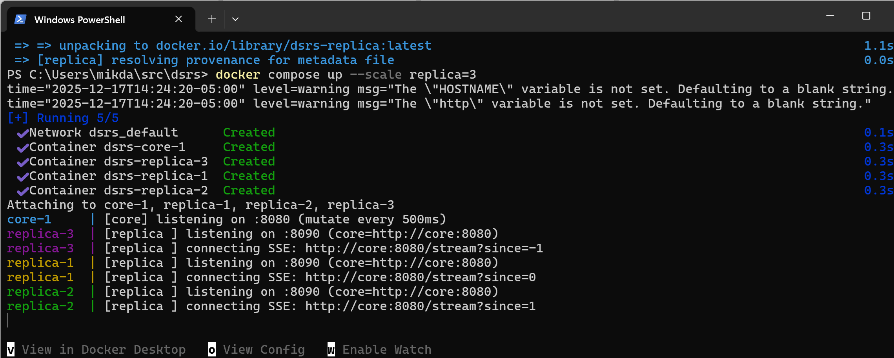

The core mutates state at a fixed interval, with replicas bootstrapping from different offsets. SSE connections established from each replica to the core, showing monotonic replica offset growth. 

The logs (in the snapshot above) confirm:

1. Correct replica discovery

2. Independent replica instances

3. Cloud-enabled DSRS scalable to thousands or even millions of instances across multiple regions globally.

## System Architecture

The following sketches represent the architecture with and without delegation:

DSRS Architecture:
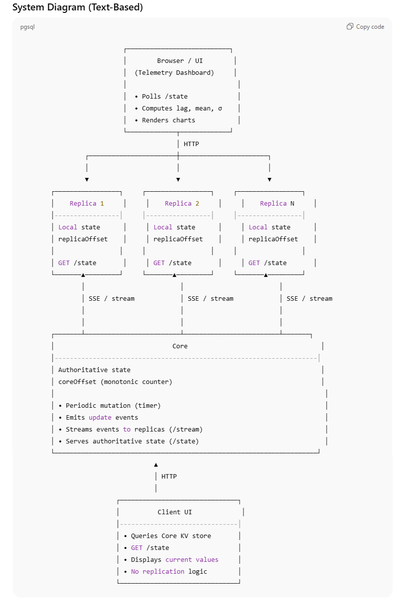

Delegation Configuration:
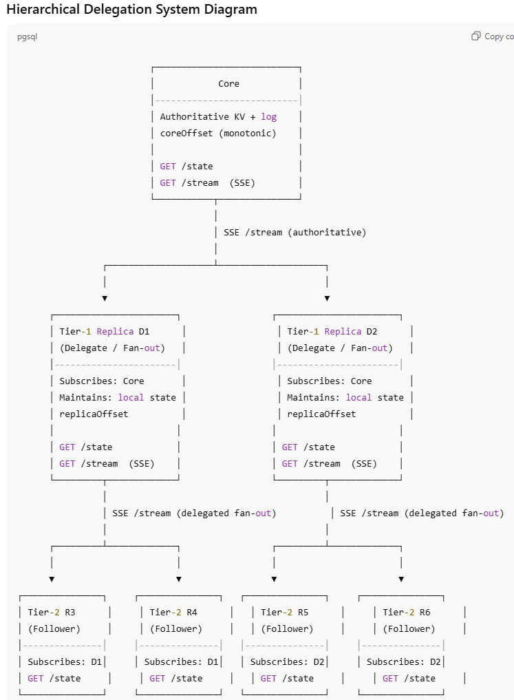


### Delegation (Hierarchical Replication) - How Replication Works

By default, all replicas subscribe directly to the core’s update stream.
When delegation is enabled, replication is organized as a hierarchical fan-out tree.

#### What Delegation Means

A small set of Tier-1 replicas (delegates) stream updates directly from the core

Remaining replicas (Tier-2 followers) stream updates from a delegate instead of the core

Delegates relay the same update stream they receive — they do not mutate or reinterpret data

The core remains the single source of truth

This reduces the number of streaming connections the core must maintain.

#### Impact

See the plots section below for a closer look at the reduction in mean replica lag and lag variance as the number of replicas increases due to replica delegation, a rather convenient benefit!

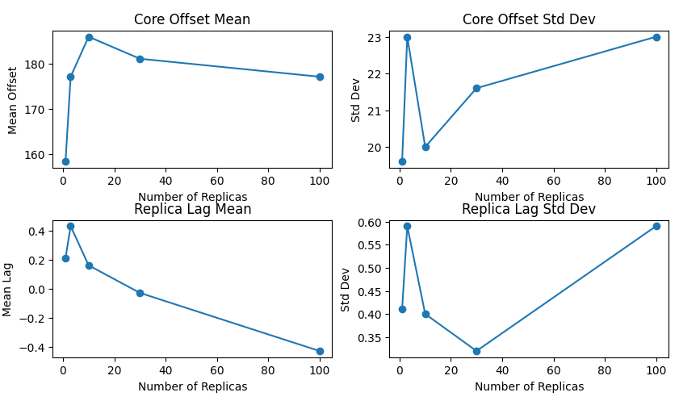

The summary stats demonstrate an approximately 1 record reduction in lag per 100 replicas when delegation is enabled, a counter-intuitive improvement in replication performance as the number of replicas scales.

## Design Choices and Trade-offs

### Design Choices
This system deliberately prioritizes simplicity, observability, and scalability of fan-out over strong consistency and fault tolerance. The trade-offs below explain these choices.

1. Single Authoritative Core vs Distributed Consensus

Choice
A single authoritative core assigns a monotonically increasing coreOffset. No leader election, quorum, or consensus protocol is implemented.

- Simple mental model
- Deterministic ordering of updates
- Low write latency
- Easy to reason about correctness

Costs

- Core is a single point of failure
- No automatic failover
- Replication halts if the core goes down

Rationale

- The goal is to study replication mechanics, not consensus
- Keeps the codebase small and understandable

2. Eventual Consistency vs Strong Consistency

Choice
Replicas are eventually consistent. Clients read only from the core.

Benefits

- High scalability
- Simple replication logic
- No blocking on slow replicas
- Lag is explicit and observable

Costs

- Replicas may be temporarily stale
- No read-your-writes guarantees on replicas
- Lag must be monitored and managed

Rationale

- Matches many real systems (log replication, followers)
- Makes consistency trade-offs visible

3. Push-based Streaming (SSE) vs Polling

Choice
Replication uses Server-Sent Events (SSE). Telemetry uses polling.

Benefits

- Low replication latency
- No polling overhead for replication
- Simple HTTP-based implementation
- Easy to debug with standard tools

Costs

- Long-lived connections
- Limited backpressure handling
- Unidirectional communication

Rationale

- SSE is easy to inspect and reason about
- Avoids message brokers or custom protocols

4. Hierarchical Delegation vs Flat Fan-out

Choice
Optional delegation introduces a hierarchical replication tree:
Core → Tier-1 delegates → Tier-2 replicas.

Benefits

- Core streaming load is bounded
- Scales to large replica counts
- Mirrors real-world fan-out architectures

Costs

- Increased replication depth
- Additional lag per tier
- Delegate failures affect downstream replicas

Rationale

- Separates control plane (core) from data plane (fan-out)
- Enables scaling experiments without changing semantics

5. Stateless Replicas vs Persistent Logs

Choice
Replicas maintain in-memory state only.

Benefits

- Fast startup
- Simple implementation
- Easy to reset and experiment

Costs

- No crash recovery
- Full catch-up required after restart
- Not suitable for durable storage

Rationale

- Focus is replication flow, not durability
- Keeps the system lightweight and inspectable

6. Observability First vs Optimization First

Choice
The system includes a browser-based telemetry dashboard.

Benefits

- Transparent system behavior
- Easy to reason about lag and scaling
- Useful for debugging and experimentation

Costs

- Polling overhead
- No long-term metrics persistence
- Not production-grade monitoring

Rationale

- Visibility is more valuable than raw throughput for this project

7. Docker-centric Execution vs Native Services

Choice
The system is primarily run using Docker Compose.

Benefits

- Reproducible experiments
- Easy scaling of replicas
- No local dependency pollution

Costs

- Networking and port complexity
- Not ideal for large-scale production orchestration

Rationale

- Enables fast iteration and portable demos
- Simpler than Kubernetes for this scope

###Technology Stack Trade-offs

Beyond architectural choices, this system makes deliberate trade-offs in its implementation technology. These choices favor clarity, approachability, and fast iteration over maximum performance or minimal footprint.

1. TypeScript (Node.js) vs Other Languages

Choice

- Core and replicas are implemented in TypeScript running on Node.js

Benefits

- Strong typing improves correctness for replication events and offsets

- Shared types between core and replicas reduce interface drift

- Fast iteration and low boilerplate

- Excellent tooling (debugging, linting, formatting)

- Large ecosystem for HTTP, SSE, and dev tooling

Costs

- Lower raw throughput than systems languages (C++, Rust, Go)

- Higher memory usage

- Garbage collection can introduce latency jitter

- Not ideal for extremely high-throughput replication pipelines

- Why TypeScript was chosen

- The project emphasizes replication semantics, not micro-optimizations

- Type safety helps prevent subtle event-ordering and state bugs

- Node’s event-driven model maps naturally to streaming replication

- In a production system, a performance-critical replication path might be implemented in Go or Rust, while keeping the same logical design.

2. HTTP + SSE vs Message Queues or Custom Protocols

Choice

- Replication uses HTTP Server-Sent Events (SSE)

Benefits

- Simple, readable protocol

- Easy to inspect with standard tools (curl, browser)

- No external dependencies (Kafka, Redis, NATS)

- Works over plain HTTP

Costs

- Unidirectional only

- Limited flow control and backpressure

- Not optimized for extremely high fan-out

- Less flexible than binary protocols

- Why SSE was chosen

- Keeps replication logic visible and debuggable

- Avoids introducing a message broker

- Sufficient for demonstrating replication behavior and delegation

3. Docker Compose vs Alternatives

Choice

- The system is orchestrated using Docker Compose

Benefits

- Reproducible local experiments

- Easy scaling of replicas (--scale replica=N)

- No need for system-wide installs

- Consistent environment across machines

Costs

- Additional networking complexity

- Port management issues on some platforms

- Not suitable for large-scale production orchestration

- Why Docker Compose was chosen

- Ideal for local experimentation and demos

- Much simpler than Kubernetes for this scope

- Enables fast iteration on replica counts

- Kubernetes or Nomad would be appropriate for production-scale experiments, but would obscure the core ideas.

4. Browser-Based Telemetry vs Dedicated Metrics Stack

Choice

- Telemetry is implemented as a static HTML + JavaScript dashboard

Benefits

- Zero infrastructure

- Immediate feedback

- Easy to modify and extend

- Works offline

Costs

- Polling overhead

- No historical persistence

- Not suitable for long-running monitoring

- Why this approach was chosen

- Emphasizes observability and understanding

- Makes lag and convergence visually obvious

- Keeps the system self-contained

5. Monorepo (npm workspaces) vs Multi-repo

Choice

- Core, replica, and common code live in a single monorepo

Benefits

- Shared types are easy to maintain

- Single versioned unit

- Simplified development workflow

Costs

- Less modular for independent deployment

- Workspace tooling complexity

- Why this choice was made

- Core and replicas evolve together

- Shared abstractions are central to correctness

- Reduces coordination overhead

6. In-Memory State vs Persistent Storage

Choice

- Core and replicas store state in memory

Benefits

- Extremely simple implementation

- Fast mutation and replication

- Easy reset and experimentation

Costs

- No durability

- No crash recovery

- State lost on restart

- Why this choice was made

- The focus is on replication flow, not storage guarantees

- Keeps the system lightweight and inspectable


---

## 📊 Browser Telemetry & Visualization

## Browser Telemetry

A browser-based telemetry dashboard is provided in:

test/replication_test.html

First, update the NUM_REPLICAS variable and REPLICA_PORT_BASE variable with a text editor.

Open it directly in the browser (no build step required) and start the test while the system is running.

The dashboard periodically polls:
- `/state` on the core
- `/state` on each replica

and visualizes:
- Core offset growth
- Replica lag (core_offset − replica_offset)
- Mean and standard deviation over time


Example Telemetry View

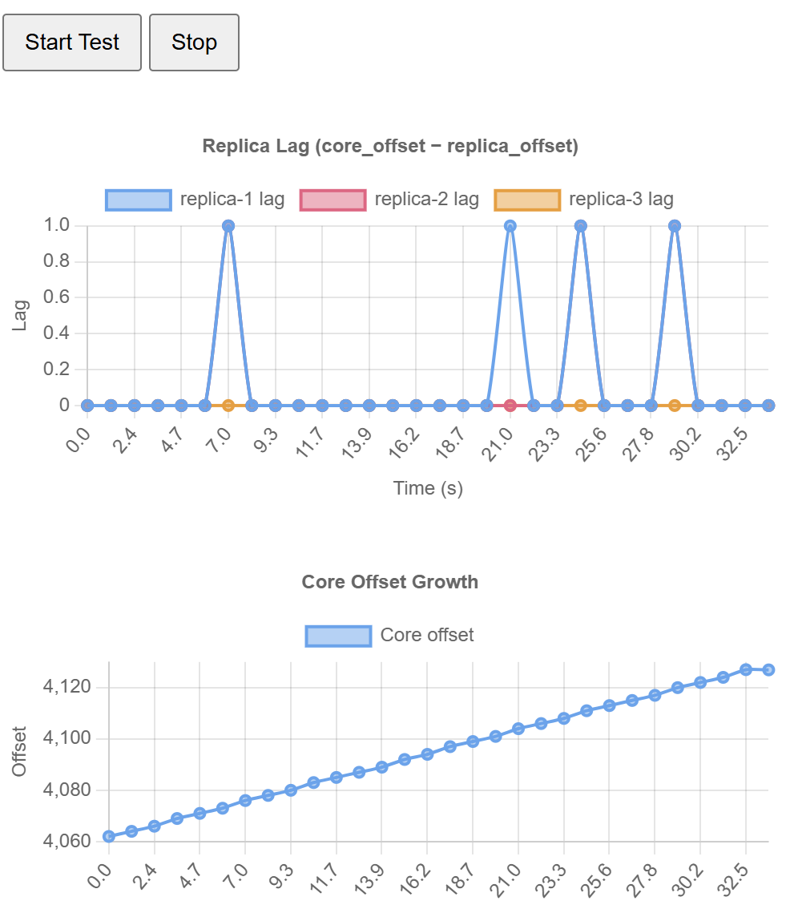


### Replica Lag

Replica lag is defined as:

lag = core_offset − replica_offset

Each replica is plotted independently, allowing inspection of:
- Catch-up behavior
- Transient lag spikes
- Steady-state consistency

The chart title displays:
- Mean lag
- Standard deviation of lag

Example (3 replicas):

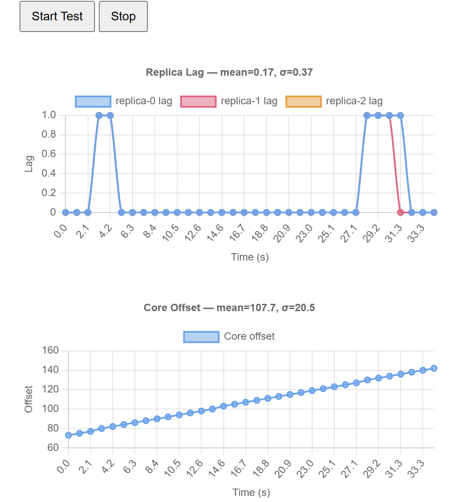


### Core Offset Growth

The core offset increases monotonically as mutations are applied.

The plot shows:
- Linear growth rate
- Mean offset
- Standard deviation over the test window

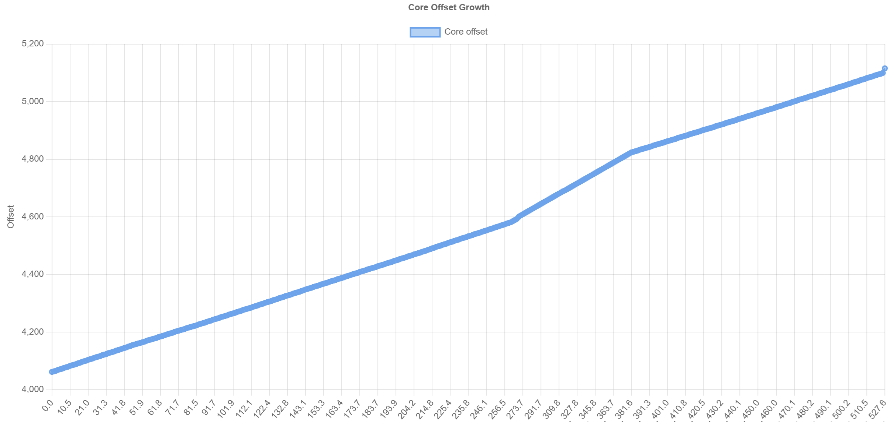


## Replica Scaling Summary

We ran the same workload while varying the number of replicas and recorded:

- Mean replica lag
- Lag standard deviation
- Core offset statistics

Representative telemetry runs:

| Replicas | Telemetry |
|---------:|----------|
| 1        | 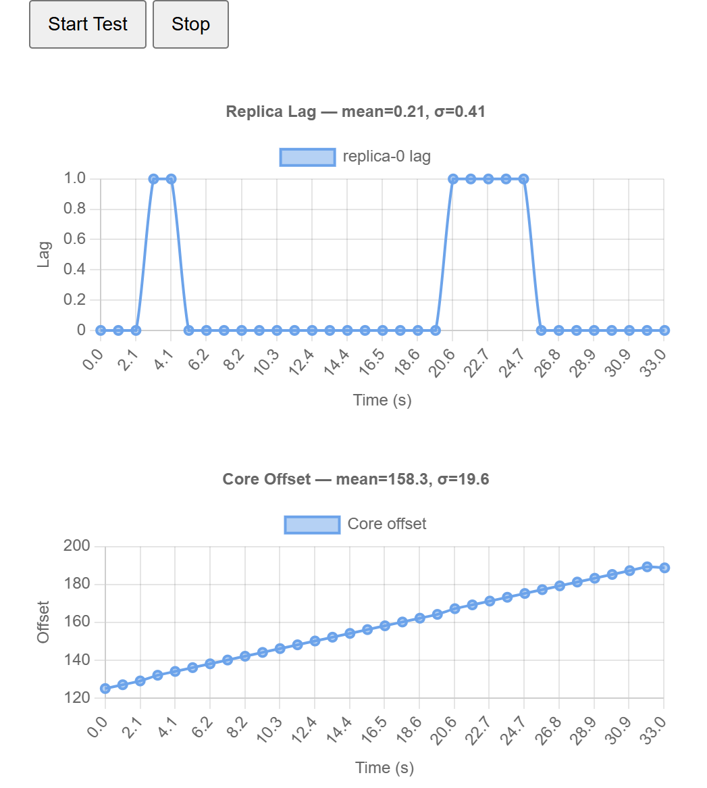 |
| 3        |  |
| 10       | 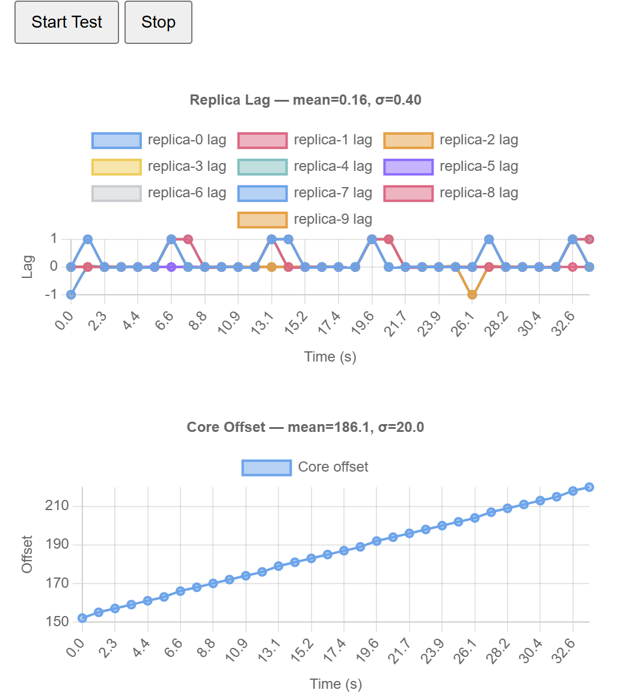 |
| 30       | 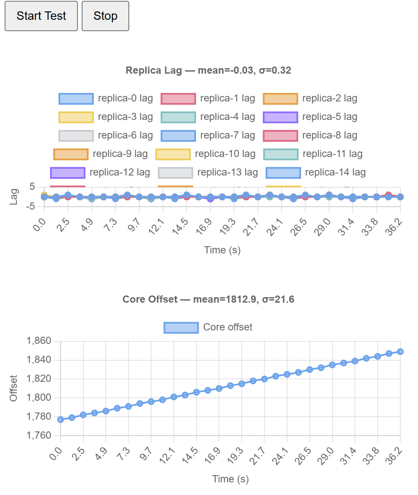 |
| 100      | 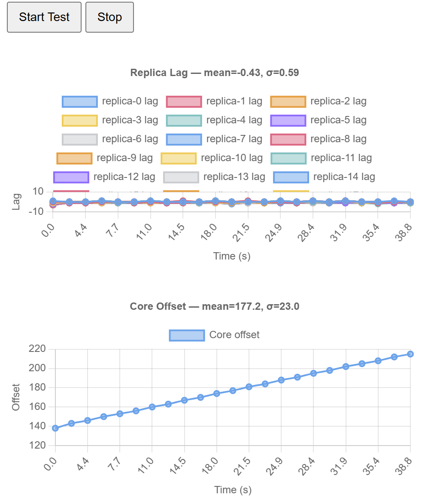 |

### Observations

- Mean lag remains low (≈ 0–1 events) under moderate replica counts
- Lag variance increases with higher replica counts
- Core offset growth remains stable and linear
- Occasional lag spikes correspond to synchronization boundaries

This behavior is expected for an eventually-consistent, push-based replication model.


## Quick start (no Docker)
```bash
npm install
# Terminal 1
npm run dev:core
# Terminal 2 (replica 1)
CORE_URL=http://localhost:8080 PORT=8091 REPLICA_ID=r1 OFFSET_FILE=./offset-r1.txt npm run dev:replica
# Terminal 3 (replica 2)
CORE_URL=http://localhost:8080 PORT=8092 REPLICA_ID=r2 OFFSET_FILE=./offset-r2.txt npm run dev:replica

```

## Possible Worlds Modeled by the State Machine
- The system models a random walk state machine, so this represents processes like Brownian motion, stock price evolution, or the financial status of a sports gambler. This was chosen because it feels somewhat relevant to sports betting.

## AI and Tools
- Tools used include ChatGPT, npm and docker. 
- AI was used to draw up boiler plate code for the components of the system, and to debug errors during development, integration and testing. 
- Many of the suggestions produced by ChatGPT were incorrect regarding root causes when full stack traces were made available in the prompt, hence I routinely had to narrow down the root cause first to a few error lines before sending out the prompt. 
- Also, drawing up system design documents remains a challenge and using textual diagram representations was the way to get reasonable looking diagrams out without having to go and search for more useful drawing tools and assistants
- Disagreed with the choice of Typescript for the bulk of implementation, but with more justification by ChatGPT regarding the ease of readability, data schema conciseness and runtime environment simplification, decided to go with the recommendation instead of using Java.
- Other than boiler plate, the AI code generation, even within narrow contexts, is frequently wrong, hence the main tactic for maintaining productivity is to minimize generation and manually make fixes and improvements when expedient to do so. 
